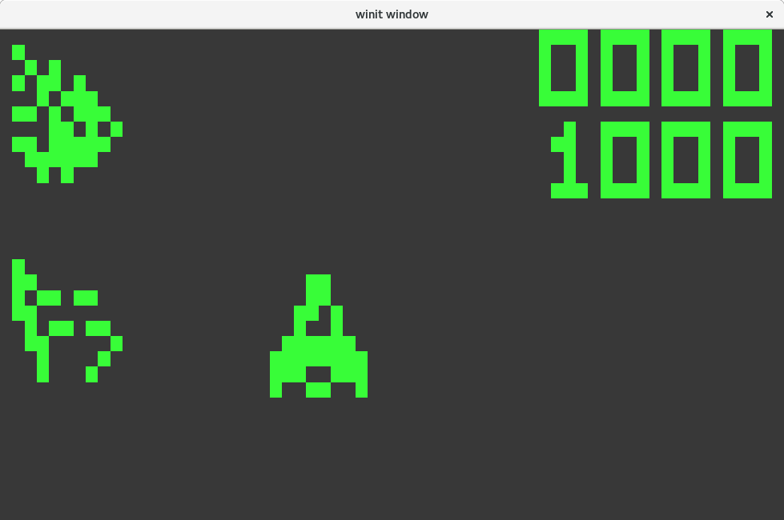
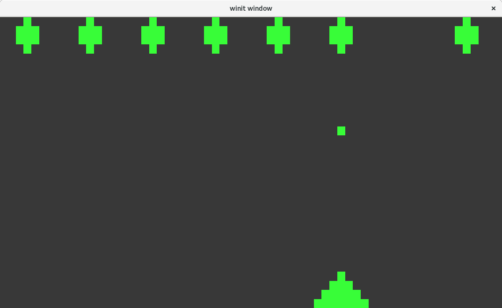
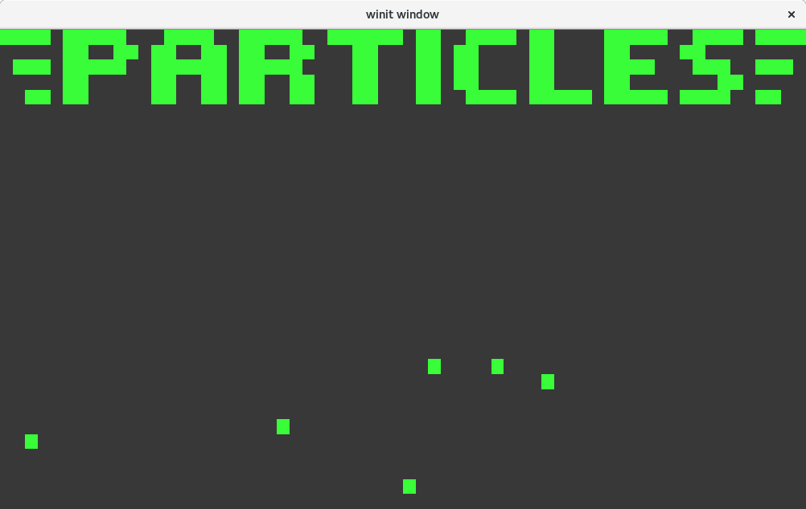

# chip8-rs

A [chip8](https://en.wikipedia.org/wiki/CHIP-8) interpreter written in Rust.

This project consists of 3 crates:
* chip8_core
* chip8_client
* fb_now

## chip8_client





You can use this pre-made `chip8_client` to play [chip8 games](https://github.com/dmatlack/chip8/tree/master/roms).

In order to run a game, you need to have [Rust installed](https://rustup.rs/).
This is using features that are currently only available in [Rust 2018](https://rust-lang-nursery.github.io/edition-guide/editions/transitioning.html).
Then, from the root directory of this repo run:
```sh
cargo +nightly run --release -p chip8_client -- "./programs/Particle Demo [zeroZshadow, 2008].ch8"
```

Insert whatever game you want to play. There are lots and lots of them.

chip8 keyboard mapping:
```
chip8      qwerty
1 2 3 C    1 2 3 4
4 5 6 D    q w e r
7 8 9 E    a s d f
A 0 B F    z x c v
```

## chip8_core

This is the chip8 interpreter.
It consists of CPU, memory, keyboard abstraction, program abstraction, and vram.
This is the nuts and bolts of the repo.
Can be easily applied to a new client if the one in this repo isn't sufficient.

## fb_now

This is a library I created to easily display a framebuffer on the screen.
Uses `winit` to get keyboard events and `glium` for `OpenGL`.